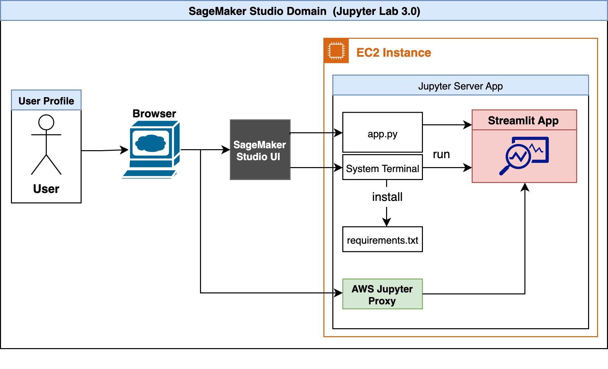
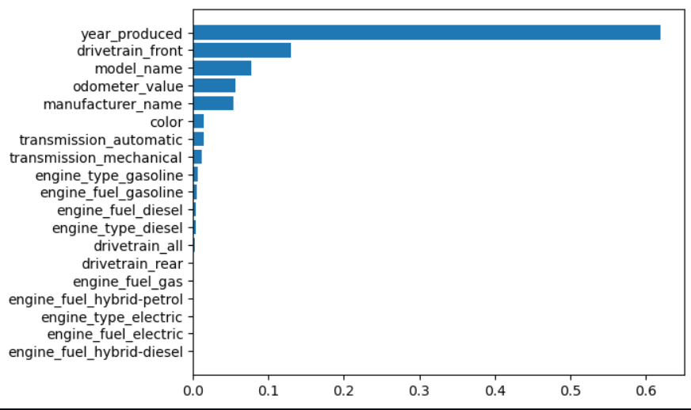

# Cloud-Computing-Project

The link to the source dataset is https://www.kaggle.com/datasets/austinreese/craigslist-carstrucks-data?select=vehicles.csv.

This is the high level diagram for the application:- 

Car price prediction using the following AWS resources:
- AWS S3 bucket for dataset storage,
- AWS SageMaker for machine learning, and 
- AWS EC2 instance to host the Streamlit app for inferencing
We have created a website where you can select various features of a car and it will predict the sales price
The dataset contains car sale price and features and  is taken from Kaggle, it has 38,522 observations with 30 variables.
Deliverable: Website that predicts car prices based on features.

Data Storage on AWS S3 Bucket:-Storing dataset for input to AWS SageMaker
Model training using AWS SageMaker:- Developing ML model by fetching data from S3 bucket and using xgboost regression in SageMaker for predictions. Achieved R score of 0.90
EC2 instance for Streamlit app:-Using EC2 for data cleaning pipelines and output generations. Hosting Streamlit app with Model on EC2 instance as well.

Amazon SageMaker's integration with Streamlit simplifies the development and presentation of machine learning (ML) model applications.
Streamlit, an open-source Python library, enables effortless creation and sharing of user-friendly web apps for ML and data science. 
Leveraging the integrated development environment (IDE) of Amazon SageMaker Studio, we can seamlessly build, run, and host Streamlit web apps within the same environment used for model development, ensuring security and reproducibility.

Streamlit serves as the ideal companion to our machine learning (ML) model integration, offering a straightforward approach to creating user-friendly web interfaces. 
With a simplified Python scripting paradigm, Streamlit allows us to effortlessly design an intuitive interface for our car price prediction application. The interface has input features, comprising number input boxes and select boxes, providing users with a streamlined way to input car specifications. 
The addition of a dedicated "Predict Price" button enhances user interaction, initiating the model's inference process. Upon user input, our ML model processes the features and generates a predicted car price, creating a seamless and interactive experience for users exploring the predictive capabilities of our system. 
Streamlit's simplicity accelerates the development of this user interface, making it a powerful tool for data scientists to showcase their ML models.

Feature importance plot:-

